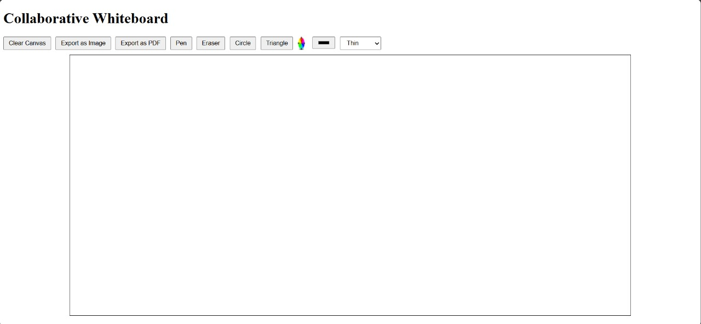

# 🎨 Collaborative Whiteboard

A **real-time collaborative whiteboard application** where users can draw, erase, and export their creations as images or PDFs. It's an ideal tool for brainstorming, sketching, or collaborating in real-time!  



---

## ✨ Features

- 🖌️ **Drawing Tools**: Pen, Eraser, Circle, and Triangle tools.
- 🎨 **Customizations**: Pick your favorite colors and adjust line thickness.
- 🧹 **Clear Canvas**: Quickly wipe the board clean.
- 📤 **Export Options**: Save your work as PNG or PDF.
- 🌐 **Real-Time Collaboration**: Share your whiteboard with others (via socket integration).
- 💡 **Responsive Design**: Works on all screen sizes.

---

## 🚀 Getting Started

Follow these instructions to get the project running on your local machine.

### 🛠️ Prerequisites

- ⚙️ Node.js (v16+)
- 📦 npm or yarn installed

### 📥 Installation

1. **Clone the Repository**

   ```bash
   git clone https://github.com/your-username/collaborative-whiteboard.git
   cd collaborative-whiteboard
